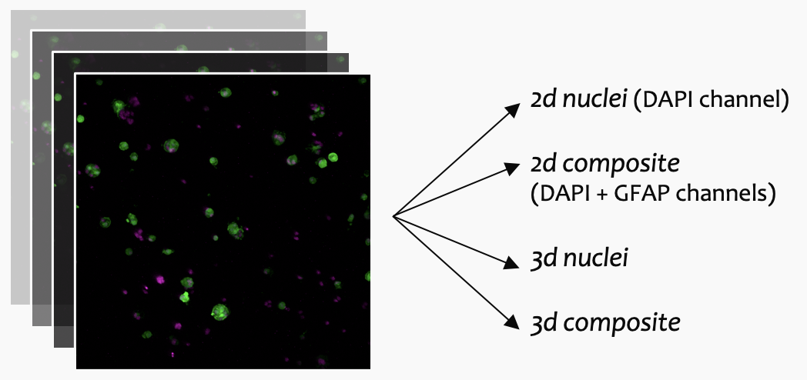

# 2nd Cycle Integrated Project
## High-throughput _in silico_ characterization of 3D astrocyte-neuron cell cultures.

The present repository encompasses the AstroNeuDL pipeline exerpt developed during the 2nd Cycle Integrated Project. The code was elaborated to meet the needs of image preprocessing, segmentation and evaluation of a dataset containing 21 images of astrocyte cultures obtained from murine-derived gray matter from P5-6 pos-natal mice.

The work here compiled was developed between September 2023 and January 2024.

## Preprocessing

The images underwent preprocessing in Fiji via an automated algorithm designed to diminish background noise and fine-tune contrast levels. This preprocessing pipeline was scripted in Python, using version 2.14.0 of the Fiji python package, pyimagej (Rueden et al., 2022).

The preprocessing consists of:
  1. Splitting GFAP and DAPI channels
  2. Normalizing the histograms to a 8-bit scale
  3. Apply filtering (mean and gaussian)
  4. Generate datasets for learning tasks

<p align="center">
  
<\p>

### Configurations:

* `use_algorithm`: "Preprocessing"
* `data`: the path for the parent directory of the dataset
* `preprocessing_steps`: a dictionary containing these parameters
  * `duplicating`: true or false
  * `normalize`: true or false
  * `filter`: true or false
  * `prepare_analysis`: true or false
* `dataset_2d_segmentation`: a dictionary containing these parameters
  * `input`: folder of the dataset to be converted for **2D Segmentation** input format
  * `rois`: folder of the rois obtained in Fiji correspondent to the data in the input
  * `output`: folder to output the formated dataset
* `dataset_3d_segmentation`: a dictionary containing these parameters
  * `input`: folder of the dataset to be converted for **3D Segmentation** input format
  * `rois`: folder of the rois obtained in Fiji correspondent to the data in the input
  * `output`: folder to output the formated dataset
* `statistics`: false or path for the data to extract statistics

### Structure

```bash
data
├── originals                    
│    ├── image_001.tif
│    ├── image_002.tif
│    │   ...
│    │   ...
│    └── image_N.tif
│
├── rois_nuclei2d                    
│    ├── image_001_nuclei2d_RoiSet
│    ├── image_002_nuclei2d_RoiSet
│    │   ...
│    │   ...
│    └── image_N_nuclei2d_RoiSet
│         ├── 0001_0001.roi
│         │   ...
│         │   ...
│         └── 9999_9999.roi 
│
└── rois_nuclei3d                    
     ├── image_001_nuclei3d_RoiSet
     ├── image_002_nuclei3d_RoiSet
     │   ...
     │   ...
     └── image_N_nuclei3d_RoiSet
          ├── image_N_nuclei3d_ind1
          ├── image_N_nuclei3d_ind2
          │   ...
          │   ...
          └── image_N_nuclei3d_indK
               ├── cell_K_001.roi
               │   ...
               │   ...
               └── cell_K_L.roi
```


## 2D Segmentation

The segmentation algorithm is intended to train the 2D instance segmentation of images with Mask R-CNN algorithm. The code was almost completely reused from the InstantDL pipeline.

### Configurations

- `use_algorithm`: "Instance Segmentation" 
- `path`: the path to your project directory here
- `use_pretrained_weights`:  Set to `True` if you want to use pretrained weights
- `pretrained_weights`: Set a relative file path from your project directory with the filename here
- `batchsize`:   Set the batchsize depending on your GPU capabilities
- `iterations_over_dataset`:  Set how many iterations over the dataset should be taken for learning. It might stop automatically if no improvement on the validation set was measured after 25 epochs
- `data_gen_args` : a dictionary including these parameters:
   -  `save_augmented_images`:  false, # true or false
   -  `resample_images`:  false, # true or false
   -  `std_normalization`:  false, # true or false
   -  `feature_scaling`:  false, # true or false
   -  `horizontal_flip`:  false, # true or false
   -  `vertical_flip`:  false, # true or false
   -  `poission_noise`:  false, # false or float 
   -  `rotation_range`:  false, # false or float (degrees)
   -  `zoom_range`:  false, # false or float (magnification)
   -  `contrast_range`:  false, # false or float 
   -  `brightness_range`:  false, # false or float 
   -  `gamma_shift`:  false, # false or float (gamma shift parameter)
   -  `threshold_background_image`:  false, # true or false
   -  `threshold_background_groundtruth`:  false, # true or false
   -  `gaussian_blur_image`:  false, # true or float
   -  `gaussian_blur_label`:  false, # true or  # true or false
   -  `binarize_mask`:  false # true or false
- `loss_function`:   MSE, MAE, dice loss, binary cross entropy, categorical cross entropy ,
- `num_classes`: Number of classes (should be 1 for binary segmenation tasks)
- `image_size`: false or tuple with dimensions of desired image size in format [x-dim, y-dim, (z-dim), channels],
e.g.: [128,128,3]
- `calculate_uncertainty`:  false # true or false
- `evaluation`  false # true or false

### Structure

```bash
path
├── train                    
│    ├── image_001_nuclei2d
│    ├── image_002_nuclei2d
│    ├── ...
│    ├── ...
│    └── image_N_nuclei2d  
│         ├── image
│         │    └── image_N_nuclei2d.png
│         │
│         └── mask
│              ├── image_N_nuclei2d_ind0.png
│              ├── ...
│              ├── ...
│              └── image_N_nuclei2d_indK.png
│
└── test                    
     ├── image_00X_nuclei2d
     ├── image_00Y_nuclei2d
     ├── ...
     ├── ...
     └── image_L_nuclei2d  
          ├── image
          │    └── image_L_nuclei2d.png
          │
          └── mask
               ├── image_L_nuclei2d_ind0.png
               ├── ...
               ├── ...
               └── image_L_nuclei2d_indK.png
```

## Evaluation

To evaluate the performance of the models. This individual evaluation is used later for comparing the performance of different models.

### Configurations

- `use_algorithm`: "Evaluation2DSeg" 
- `data`: the path for the parent directory of the dataset
- `divisions`:  128, # ideally an integer division of the image size (1024×1024)
